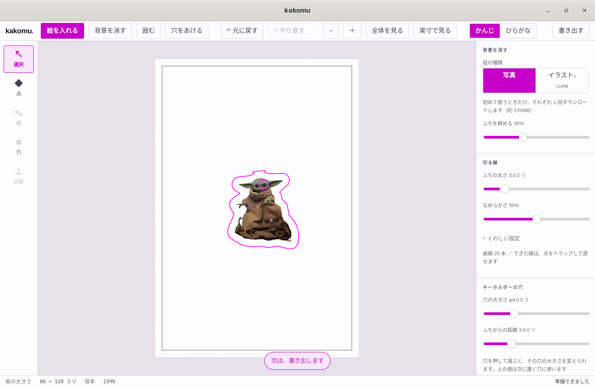
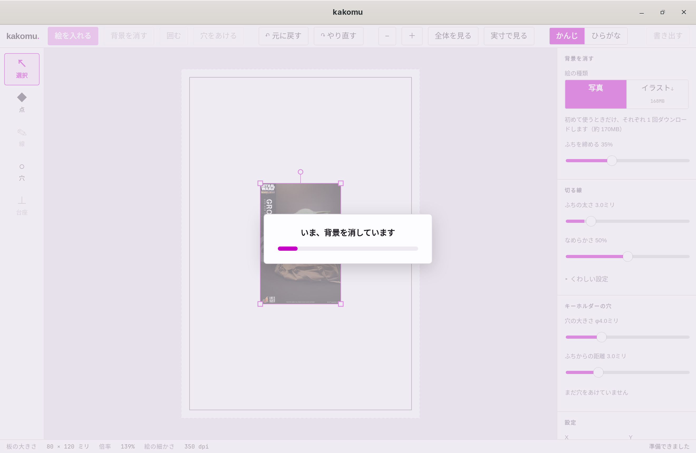
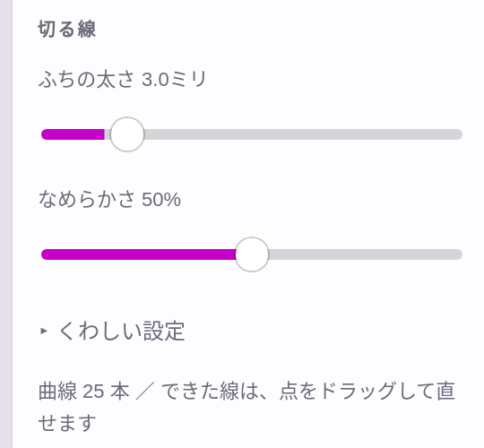
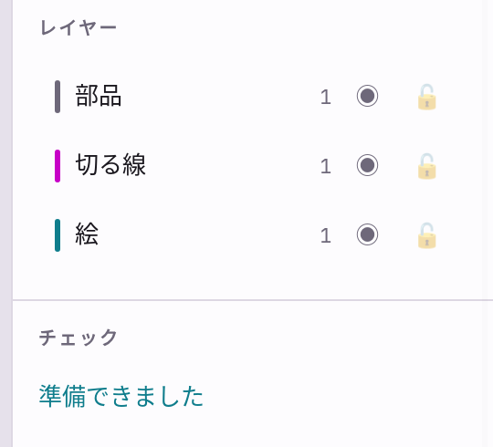

# kakomu

アクリルキーホルダーの加工データを作るデスクトップアプリです。
絵を読み込み、背景を消し、その外側に切る線を作り、キーホルダーの穴をあけて、
レーザー加工機に渡す SVG と UV プリンターに渡す PDF を書き出します。
[青学つくまなラボ](https://sites.google.com/view/tukumanalab/)の機材に合わせて作っています。



- サイト: https://tukumanalab.github.io/kakomu/
- 仕様書: [SPEC.md](SPEC.md)（計画段階の内容を含み、実装と違うところがあります）

## 現状

最新は **v0.2.1（プレリリース）** です。Windows / macOS / Linux 向けに配布しています。

**できること**

- 絵の読み込みと配置（移動・拡縮・回転・数値入力）
- 背景を消す（推論は手元で実行）
- 切る線の自動生成と、点ごとの修正
- キーホルダーの穴（自動配置・クリックで配置・複数）
- 切るデータ（SVG）と印刷するデータ（PDF）の書き出し
- 表示の「かんじ／ひらがな」切り替え

**まだできないこと**

- 作業の保存と読み込み。アプリを閉じると作業内容は残りません
- アクリルスタンドの台座（左の「台座」は押せません）
- 線を描くこと（左の「線」は押せません）と、点の追加
- 板の大きさの変更（80 × 120 mm で固定）
- レイヤーのロック（鍵のボタンは表示が切り替わるだけで、編集は止まりません）
- コード署名（どの OS でも初回起動時に警告が出ます）

**出力先の機材**

| | |
|---|---|
| レーザー加工機 | xTool P3（XCS） |
| UV プリンター | Roland VersaSTUDIO BD-8（VersaWorks 7） |

## 入れかた

[Releases](https://github.com/tukumanalab/kakomu/releases) からダウンロードします。

| OS | ファイル |
|---|---|
| Windows | `kakomu_<版>_x64_en-US.msi` または `kakomu_<版>_x64-setup.exe` |
| macOS（Intel / Apple Silicon） | `kakomu_<版>_universal.dmg` |
| Linux | `kakomu_<版>_amd64.AppImage` / `kakomu_<版>_amd64.deb` / `kakomu-<版>-1.x86_64.rpm` |

### Windows

`.msi`（または `-setup.exe`）を実行します。「WindowsによってPCが保護されました」と出たら、**「詳細情報」→「実行」** を選びます。

### macOS

`.dmg` を開いて Applications に入れます。初回は「開発元を確認できないため開けません」と出るので、
アプリを **右クリック →「開く」** で起動します。2 回目以降はそのまま開けます。

### Linux（一般）

```sh
chmod +x kakomu_*.AppImage
./kakomu_*.AppImage
```

### Arch Linux / Omarchy

AUR にはまだ登録していないので、`yay -S kakomu-bin` では入りません。
このリポジトリの `PKGBUILD` から入れます。依存パッケージも一緒に入ります。

```sh
git clone https://github.com/tukumanalab/kakomu.git

# ビルド済みの .deb（Releases）を展開して入れる
cd kakomu/packaging/aur/kakomu-bin
makepkg -si

# ソースからビルドする場合
cd kakomu/packaging/aur/kakomu
makepkg -si
```

パッケージの定義と更新手順は [`packaging/aur/`](packaging/aur/) にあります。
起動しないときは `ldd /usr/bin/kakomu | grep 'not found'` で足りないライブラリを確かめてください。

#### AppImage を手で入れる場合

依存を自分で入れます。

```sh
sudo pacman -S --needed \
  webkit2gtk-4.1 gtk3 librsvg \
  xdg-desktop-portal xdg-desktop-portal-gtk xdg-desktop-portal-hyprland \
  fuse2
```

| パッケージ | 用途 |
|---|---|
| `webkit2gtk-4.1` `gtk3` `librsvg` | 画面の描画。無いと起動しません |
| `xdg-desktop-portal` と `xdg-desktop-portal-gtk` | ファイルを選ぶダイアログ。`-gtk` が無いと「絵を入れる」を押しても何も出ません |
| `xdg-desktop-portal-hyprland` | Hyprland で portal を使うため |
| `fuse2` | AppImage の実行 |

画面が真っ白になる、描画が崩れるときは、WebKitGTK の DMABUF レンダラを切ります。

```sh
WEBKIT_DISABLE_DMABUF_RENDERER=1 ./kakomu_*.AppImage
```

毎回指定しない場合は `~/.config/environment.d/kakomu.conf` に書いておきます。

```
WEBKIT_DISABLE_DMABUF_RENDERER=1
```

## 使いかた

上のバーのボタンを左から順に押していきます。画面の下には、次にやることが表示されます。

1. **絵を入れる** — 画像を選ぶか、窓にドラッグします
2. **背景を消す** — 絵の背景を透明にします
3. **囲む** — 絵の外側に切る線ができます
4. **点**（左の道具）— 切る線の点を動かして形を直します
5. **穴をあける** — キーホルダーの穴を置きます
6. **書き出す** — SVG と PDF を同じフォルダに書き出します

### 絵を入れる

- 「絵を入れる」ボタンか、窓へのドラッグ＆ドロップで読み込みます。対応形式は PNG / JPEG / WebP / TIFF です
- 実寸は画像の解像度情報（PNG の pHYs、JPEG の JFIF）から決めます。読めないときは 350dpi とみなします
- 板（80 × 120 mm）の中央に置きます。板からはみ出すときは、収まる大きさまで縮めます
- 一辺が 16,000px を超える画像は読み込めません
- 読み込んだ画像はアプリのキャッシュに複製して使います。元のファイルは変更しません

### 配置を変える

- 「選択」の道具で、ドラッグで移動、四隅で拡縮、上の丸で回転します
- 右の「設定」で X・Y・幅・高さ（mm）と角度（度）を数値で入力できます。「縦横の比を保つ」は最初からオンです
- 選んだ絵の実効解像度は、下のバーの「絵の細かさ」に dpi で出ます

### 背景を消す

- rembg が配布している IS-Net の ONNX モデルを、手元で `ort` を使って実行します。画像は外部に送信しません
- 「絵の種類」でモデルを選びます

  | 表示 | モデル |
  |---|---|
  | 写真（既定） | `isnet-general-use` |
  | イラスト | `isnet-anime` |

- モデルは初めて使うときに 1 回だけダウンロードし（それぞれ約 170MB）、アプリのデータフォルダに置きます。まだ手元に無いモデルには、ボタンにダウンロードの大きさが出ます
- 「ふちを締める」（0〜100%、既定 35%）を上げると、境目に残る半透明の部分が減ります
- 処理中は、ダウンロードの進み具合・準備・背景を消す・画像を作る、の段階を表示します
- 処理は毎回元画像から行います。モデルや設定を変えてやり直せ、「元に戻す」で消す前に戻せます。「消す前と見比べる」で元画像と切り替えて表示できます



### 切る線を作る（囲む）



- 選んでいる絵（絵が 1 枚だけならその絵）の透明度から作ります。背景を消してあればその結果を、まだなら元画像を使います
- 設定を変えたら、もう一度「囲む」を押すと作り直します

  | 設定 | 範囲 | 既定 |
  |---|---|---|
  | ふちの太さ | 0〜20 mm | 3.0 mm |
  | なめらかさ | 0〜100% | 50% |
  | 細すぎるところを直す（くわしい設定） | オン／オフ | オン |
  | 内側の穴を残す（くわしい設定） | オン／オフ | オフ |
  | 半透明をどこから残すか（くわしい設定） | 1〜254 | 128 |
  | 小さな点を無視する（くわしい設定） | 0〜50 mm² | 4.0 mm² |

- 透明度を距離場にして外側へ広げ、輪郭を三次ベジェ曲線に当てはめます。角は丸くなります。できた曲線の本数をパネルに出します
- 幅 1.5 mm 未満のところは、「細すぎるところを直す」がオンなら太らせて、そのことを注意として出します。直しきれなかったときはエラーになります
- 「内側の穴を残す」がオンで、内側の穴が φ2 mm 未満のときはエラーになります
- 切る線は 1 本だけです。作り直すと前の線と置き換わります。点を手で直したあとなら、置き換える前に確認します
- 作り終わると、道具が「点」に切り替わります

### 点を直す

- 「点」の道具で、切る線の点が表示されます
- 点をドラッグすると、その部分の形が変わります
- 点を選ぶとハンドルが出て、ドラッグで曲がりかたを変えられます。なめらかな点では反対側のハンドルが向きを揃えて動き、角の点では片側だけが動きます
- 選んだ点は Delete / Backspace で消せます。3 点より少なくはできません

### 穴をあける

- 「穴をあける」は、切る線があるときに押せます。切る線の内側で、条件を満たす場所のうちいちばん上に穴を置きます。押すたびに、ほかの穴を避けて 1 つずつ増えます。置ける場所が無いときはエラーを出します
- 条件は、穴のふちから切る線のふちまで、およびほかの穴のふちまでが「ふちからの距離」以上あることです
- 「穴」の道具では、押した場所にそのまま穴を置きます。すでにある穴を押すと、その穴をドラッグで動かせます
- 選んだ穴は、四隅のハンドルで大きさを変えられます。右の「設定」では X・Y・穴の大きさを数値で入力できます
- 「キーホルダーの穴」パネル

  | 設定 | 範囲 | 既定 |
  |---|---|---|
  | 穴の大きさ | φ2〜10 mm | φ4.0 mm |
  | ふちからの距離 | 1〜10 mm | 3.0 mm |

  穴を選んでいるときはその穴に位置を変えずに反映し、選んでいないときは次に置く穴に使います。
  穴を選んでいるときは「自動で置き直す」で、その穴を自動の配置に置き直せます

- 穴は「部品」レイヤーに入り、切る線と同じ色・線幅で書き出されます

### チェック

右下の「チェック」と下のバーに、次の問題を出します。エラーがあっても書き出しは止めません。

| 内容 | 基準 | 種類 |
|---|---|---|
| 絵の実効解像度 | 300dpi 未満 | 注意 |
| 穴の大きさ | φ2 mm 未満 | エラー |
| 穴が切る線からはみ出している | — | エラー |
| 穴のふちから切る線のふちまで | 「ふちからの距離」未満 | エラー |
| 穴どうしの間隔／重なり | 「ふちからの距離」未満 | エラー |

切る線を作ったときの検査（幅・内側の穴）は、「切る線」パネルに出ます。

### レイヤー



レイヤーは「部品」「切る線」「絵」の 3 つで固定です。数字は中にあるものの数です。
◉ のボタンで表示を切り替えられ、非表示のレイヤーは書き出しません。

| レイヤー | 中身 | 書き出し先 |
|---|---|---|
| 部品 | キーホルダーの穴 | SVG |
| 切る線 | 生成・修正した切る線 | SVG |
| 絵 | 読み込んだ画像 | PDF |

### 書き出す

絵を入れると、上のバーの右端に「書き出す」が出ます。フォルダを選ぶと、2 つのファイルを同時に書き出します。
ファイル名は最初に読み込んだ画像の名前から付けます。

| ファイル | 中身 | 渡す先 |
|---|---|---|
| `<名前>_切る.svg` | 切る線と穴 | レーザー加工機 xTool P3 |
| `<名前>_印刷.pdf` | 絵 | UV プリンター Roland BD-8 |

**SVG**

- 大きさは板と同じ 80 × 120 mm。1 ユーザー単位 = 1 mm
- 線は `#FF00FF`、線幅 0.1 mm、`fill="none"`
- パスは三次ベジェだけで書き、変形は座標に反映済み
- 切る線も穴も無いときは、板の外形（角の半径 3 mm の角丸長方形）を代わりに書き出し、そのことを書き出し後に表示します

**PDF**

- ページは板に塗り足し 3 mm を加えた 86 × 126 mm。TrimBox が板の範囲です
- 背景を消した絵はその結果を使い、透明な部分は SMask で残します
- 600dpi を超える画像は 600dpi に落として埋め込みます
- 白版は作りません（VersaWorks 側で作ります）
- PDF はライブラリを使わず自前で生成しています

書き出し後の画面に、どちらのファイルをどの機械に渡すかを表示します。

### よみかた

上のバーの「かんじ／ひらがな」で表示の文言を切り替えます。変わるのは文言だけで、書体・文字の大きさ・配置は変わりません。
選んだほうは次に起動したときも残ります。ひらがなの文言は [`src/app/i18n/ja-hira.json`](src/app/i18n/ja-hira.json) に書いてあります。

| かんじ | ひらがな |
|---|---|
| 絵を入れる | えを いれる |
| 背景を消す | うしろを けす |
| 囲む | かこむ |
| 穴をあける | あなを あける |
| 書き出す | ほぞん する |
| チェック | しらべた けっか |

### 操作

| 操作 | 動き |
|---|---|
| ホイール | 表示を上下左右に動かす |
| Ctrl / ⌘ + ホイール | 拡大・縮小 |
| 中ボタンでドラッグ、Space + ドラッグ | 表示を動かす |
| Shift + ドラッグ | 移動は縦か横に固定、拡縮は縦横比を保つ、回転は 15° 刻み |
| Ctrl / ⌘ + Z | 元に戻す（ドラッグ 1 回で 1 回分） |
| Ctrl / ⌘ + Shift + Z | やり直す |
| Delete / Backspace | 選んだものを消す（「点」の道具では選んだ点を消す） |

上のバーの「−」「＋」「全体を見る」「実寸で見る」でも表示を変えられます。

## 開発

必要なもの: Node.js 22、pnpm 9、Rust（stable）。Linux では `webkit2gtk-4.1` などの Tauri の依存も要ります。

```sh
pnpm install
pnpm app      # アプリを起動する（tauri dev）
```

```sh
pnpm check    # 型検査
pnpm test     # フロントエンドの単体テスト（vitest）
pnpm build    # フロントエンドのビルド
cd src-tauri && cargo test   # Rust の単体テスト
```

`pnpm test` には、ひらがなの辞書にかんじの辞書のキーがすべてあるかの検査が入っています。

### CI とリリース

| ワークフロー | 起動 | 内容 |
|---|---|---|
| `ci.yml` | main への push、PR | 型検査・テスト・ビルド、Rust の fmt / clippy / test（3 OS）、Arch Linux コンテナでのビルド |
| `release.yml` | `v*` タグの push | 3 OS のインストーラを作り、下書きのプレリリースに添付 |
| `pages.yml` | `docs/` を変えて main に push | `docs/` を GitHub Pages に公開 |

### 構成

- **アプリ**: Tauri v2
- **フロントエンド**（`src/`）: TypeScript + Solid.js。キャンバスは SVG DOM。ドキュメントと元に戻す／やり直す、点の編集、穴の配置とチェック、SVG の組み立て
- **Rust**（`src-tauri/src/`）
  - `commands/image.rs` — 画像の取り込みと解像度の読み取り（`image`）
  - `matting/` — 背景除去。ONNX 推論（`ort`）とモデルのダウンロード（`reqwest`）
  - `cutline/` — 切る線の生成。距離場 → 細い部分の太らせ → 輪郭抽出 → 簡略化 → 三次ベジェの当てはめ
  - `export/pdf.rs` — PDF の生成（圧縮に `flate2` のみ使用）

## ライセンス

[MIT](LICENSE)
