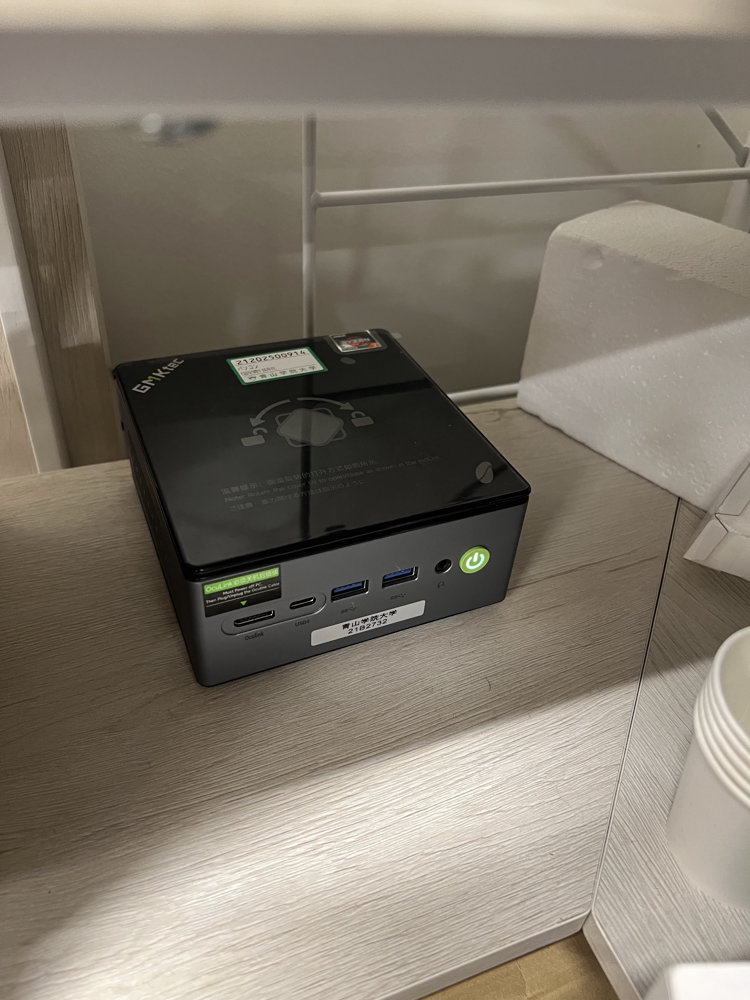
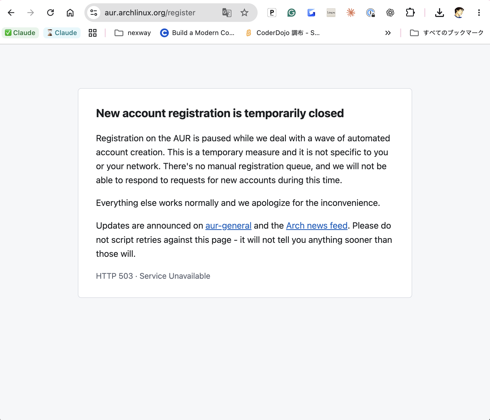

  
kakomu

  <h1>Omarchy 向けに アクキー、アクスタ作成アプリを作った</h1>

石原 淳也 @jishiha

<!--
タイトルの枠はアプリの「切る線」、上の丸は「キーホルダーの穴」のつもり。
-->

---
layout: default
class: profile-slide
---

# 自己紹介

  

    
    
石原 淳也

    
X <code>@jishiha</code> GitHub <code>@champierre</code>

  

  <ul class="facts">
    <li><strong>合同会社つくる社</strong> 代表社員／<strong>株式会社まちクエスト</strong> 代表取締役</li>
    <li><strong>青山学院大学</strong> プロジェクト准教授 青学つくまなラボ フェロー</li>
    <li>フリーランスで、おもに <strong>Ruby on Rails</strong> のプロジェクトを手伝う</li>
    <li><strong>まちクエスト</strong> を運営 https://machique.st</li>
  </ul>

kakomu は、<strong>つくまなラボ</strong>でアクキー・アクスタを作るために作りました

---
layout: default
class: machine-slide
---

# わたしの Omarchy マシン

GMKtec ミニPC AMD Ryzen7 8845HS搭載 ￥76,580

<figure class="machine">
  
</figure>

---
layout: default
class: arch-slide
---

# kakomu のアーキテクチャ

Tauri v2 — 触って動かすのはフロント、時間のかかる計算は Rust

  <section class="box front">
    <header>WebViewTypeScript + Solid.js</header>
    <ul>
      <li>キャンバスは <strong>SVG DOM</strong> 当たり判定はブラウザ任せ</li>
      <li>ドキュメントと undo／redo</li>
      <li>点のドラッグ、穴の配置とチェック</li>
      <li>切るデータ <code>.svg</code> はここで組み立て</li>
    </ul>
  </section>

  

    
IPC

    
invoke→

    
←Channel（進捗）

    
画像は JSON に載せず <code>asset://</code> で渡す

  

  <section class="box core">
    <header>Rustcore</header>
    <dl>
      <dt>matting</dt>
      <dd><code>ort</code> で ONNX 推論（<code>u2netp</code> ほか） <strong>画像は外に出さない</strong></dd>
      <dt>cutline</dt>
      <dd class="pipeline">
        アルファ<i>→</i>距離場で 3mm 広げる<i>→</i>細い所を太らせる<i>→</i>輪郭抽出<i>→</i>三次ベジェ
      </dd>
      <dt>export</dt>
      <dd>PDF は<strong>ライブラリなしで自前</strong>（TrimBox・透過）</dd>
    </dl>
  </section>

  
<code>名前_切る.svg</code><i>→</i>レーザー加工機 xTool P3

  
<code>名前_印刷.pdf</code><i>→</i>UV プリンター Roland BD-8

  
GitHub Actions で dmg／msi／AppImage／deb<i>→</i>Omarchy は AUR <code>kakomu-bin</code>

<!--
- Tauri を選んだのは、OS の WebView を使うので Wayland / Hyprland でも素直に動くから。バイナリも軽い
- 切る線は、仕様では Clipper2 でポリゴンをオフセットする予定だったが、入力がラスタなので距離場にした。角が自然に丸くなり、自己交差も原理的に起きない
- 細い所は「消す」のではなく「太らせる」。消すと尻尾やリボンが線からはみ出す
- Omarchy の落とし穴: xdg-desktop-portal-gtk が無いとファイルダイアログが出ない。描画が崩れたら WEBKIT_DISABLE_DMABUF_RENDERER=1
-->

---
layout: default
class: aur-slide
---

# AUR の新規登録が一時停止中

自動で作られるアカウントが大量に来ているため、新しい登録を止めている（HTTP 503）

<figure class="screenshot">
  
</figure>

---
layout: default
class: remote-slide
---

# Omarchy にリモートでつなぐ

Sunshine × Moonlight を、Tailscale の上で使う

  <section class="box client">
    <header>Moonlight手元のパソコン</header>
    <ul>
      <li>送られてきた画面を表示する</li>
      <li>キーボードとマウスの操作を送る</li>
    </ul>
  </section>

  

    
Tailscale

    
←画面

    
入力→

    
ポートを開けなくても 別のネットワークから届く

  

  <section class="box host">
    <header>SunshineOmarchy マシン</header>
    <ul>
      <li>画面を取り込んで、動画にして送る</li>
      <li>届いた操作をそのまま反映する</li>
      <li>kakomu はこちらで動いている</li>
    </ul>
  </section>

---
layout: center
class: demo-slide
---

  <h1>デモ</h1>

---
layout: default
class: media-slide
---

# レーザーカッター

xTool P3

<code>名前_切る.svg</code> の線に沿って、アクリルを切る

<SlidevVideo class="clip" autoplay autoreset="slide" muted loop playsinline print-timestamp="10">
  <source src="./lazercutter.mp4" type="video/mp4">
</SlidevVideo>

---
layout: default
class: media-slide
---

# UV プリンター

Roland BD-8

<code>名前_印刷.pdf</code> を、アクリルに印刷する

<SlidevVideo class="clip" autoplay autoreset="slide" muted loop playsinline print-timestamp="10">
  <source src="./uv.mp4" type="video/mp4">
</SlidevVideo>

---
layout: center
class: title-slide end-slide
---

  
kakomu

  <h1>ありがとうございました</h1>

  
GitHub <code>github.com/tukumanalab/kakomu</code>

  

